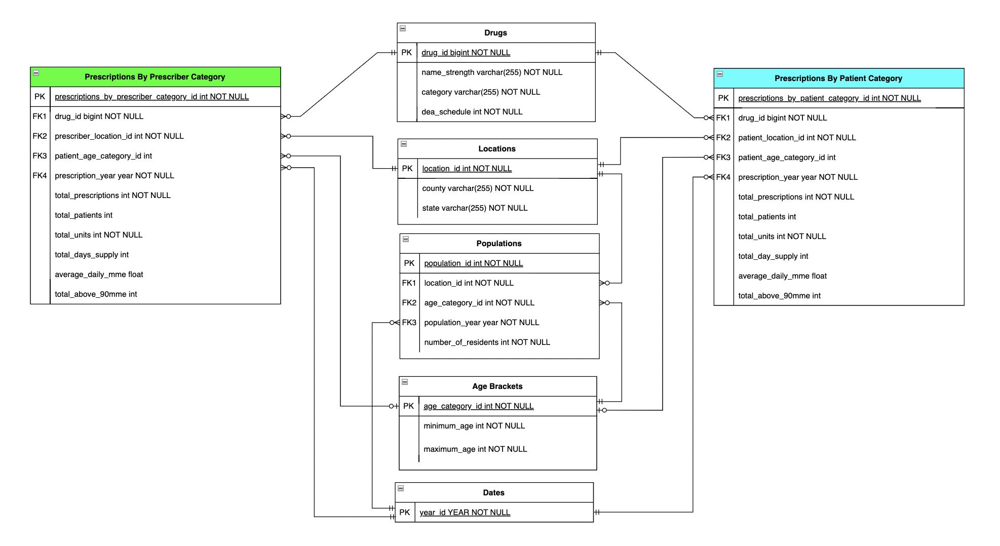

# Michigan Controlled Substance Dashboard

## Description

The "Michigan Controlled Substance Dashboard" has been developed as a dynamic Power BI visualization, utilizing data science techniques to analyze and derive meaningful insights into Controlled Substance Prescribing Practices from 2013-2022. This initiative capitalizes on extensive and publicly accessible datasets, crafting an immersive visualization tool that fosters an enriched understanding of controlled substance prescription trends within the state of Michigan. In total, this project examines 10 years and more than 2.6 million data rows, resulting in a comprehensive analysis.

## Project Objectives

The primary objectives of this project are as follows:

- **User-Focused Tool**: The dashboard of this project is designed to serve healthcare providers, legislators, public health organizations, and those interested in Opioid Stewardship by providing insights into the nuances of controlled substance prescribing trends.

- **Educational Integration**: The analytical database that underpins the project will be integrated into Oregon State University's CS-340 course, offering hands-on experience in data science techniques and database concepts to students in OSU's Bachelor of Computer Science program.

## Features

- Interactive display to explore controlled substance prescribing practices over time.
- Comparative analysis of different controlled substances categories and patient age-brackets.
- Geospatial representations showcasing prescription hotspots across Michigan counties.
- Trends analysis to identify potential shifts in prescribing practices and their implications.
- Dynamic interface equipped with custom data filters.

## Datasets

The project utilizes publicly-accessible datasets. 
- Controlled Substance Data: Prescription data draws from Michigan's Annual Drug Utilization Reports. Datasets are available for download [here](https://www.michigan.gov/lara/bureau-list/bpl/health/maps/reports).
- Population Estimates: Population estimates draw from National Center for Health Statistics (NCHS) reports. Datasets are available for download [here](https://vitalstats.michigan.gov/osr/Population/npPopAgeGroupSlider.asp?AreaType=C).

## Data Wrangling
Data Discovery
- A preliminary exploratory analysis of CSV data was performed using Pandas to discern distributions, ranges, and potential issues.

Data Structuring
- Age-bracket categories within the Population datasets were aligned to correspond with those in the Controlled Substance datasets, ensuring uniformity for cross-dataset analysis.
    - e.g. age-brackets `<1` and `1-4` were merged to form the consolidated `0-4` bracket
- Given that zip codes wouldn't factor into any subsequent analyses, data for patients/providers within the same county but different zip codes for reporting years 2021-2022 was aggregated to maintain consistency with earlier datasets that utilize county as the primary unit of consideration.
- Disparate population datasets that were categorized by patient demographics (children, young adults, older adults) were unified to form a comprehensive overview of patient population data across all ten reporting years.

Data Cleaning
- Consistency was ensured for categorical data across reporting years (e.g. `3` vs. `Schedule 3`, `MI` vs. `Michigan`).
- Special values were managed to ensure integrity of SQL commands (eg conversion of `N/A` to `NULL` for accurate SQL insertion).
- Relevant data (`Total_Prescriptions`, `Total_Units`, `Total_Patients`, `Total_Days_Supply`) was converted to integer datatype to align with schema constraints.
- Hydrocodone combination products dispensed in 2013 were reclassified as Schedule 2 drugs, in line with the subsequent reclassification by the Drug Enforcement Administration from Schedule 3 to Schedule 2 on October 6, 2014. This adjustment was made to maintain consistency across reporting years.
- String data was trimmed and formatted to ensure uniformity and prevent whitespace and/or capitalization mismatches.

Data Enriching
- The population dataset was integrated to provide a broader demographic context to prescribing trends.

Data Validation
- Data integrity was assessed against logical constraints and patterns to uncover potential outliers.
- Each field's datatype was validated to ensure its alignment with the expected format.
- Thorough examination of the data was conducted to detect and rectify missing values, ensuring dataset completeness.
- MME values for non-opiate drugs were verified to be absent.

Data Publishing
- Divergent CSV data was transformed into structured Data Definition Language (DDL) scripts using Python and Pandas; these scripts laid the foundation for subsequent Extract, Transform, Load (ETL) processes within the MySQL database environment that formed the analytical database.

## Database Schema

The schema of the analytical database was carefully designed to account for any inherited limitations due to the de-identified nature of the prescription data.
Two fact-tables (`Prescriptions_By_Prescriber_Category` and `Prescriptions_By_Patient_Category`) were created containing the following facts: 
- `total_prescriptions`
- `total_patients`
- `total_units`
- `total_days_supply`
- `average_daily_MME`
- `total_above_90MME`

Both fact tables are dimensionalized by `Drugs`, `Locations`, `Populations`, `Age Brackets`, and `Years`.

## ETL Process
Python scripting was used to create Data Definition Language (DDL) files that wrangled the data into a MySQL database.

MySQL "views" were generated to match the predefined star schema creating a logical structure that aligned with the analytical requirements.

Views from the MySQL database were exported as SQL files that encapsulated the organized data and schema structure.

Using the SQL files, the data was then re-imported back into the MySQL environment, establishing the actual analytical database, and incorporating the structured views and data.

## Power BI Dashboard
*(forthcoming)*

## Contribution Guidelines

Contributions to this project are welcome! If you find any issues or have suggestions for improvement, please create a pull request. For major changes, please open an issue first to discuss the proposed changes.